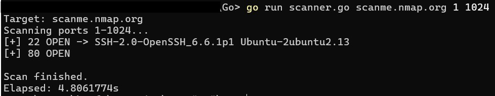

# Go Port Scanner 🚀

Simple concurrent TCP port scanner written in Go.



## Features

- Fast scanning with goroutines
- Configurable port range
- Timeout control
- Banner grabbing
- Semaphore concurrency limit

## Usage
    go run scanner.go <host> <startPort> <endPort>

## Example
    go run scanner.go scanme.nmap.org 1 1024

## Output
    [+] 22 OPEN -> SSH-2.0-OpenSSH

## Tech Stack

- Go (Golang)
- net
- sync
- bufio
- time

## Libraries used
- fmt | https://pkg.go.dev/fmt  
- net | https://pkg.go.dev/net  
- sync | https://pkg.go.dev/sync  
- bufio | https://pkg.go.dev/bufio  
- time | https://pkg.go.dev/time  
- os | https://pkg.go.dev/os  
- strconv | https://pkg.go.dev/strconv  

⚖️ Legal Disclaimer / Yasal Uyarı
  ```bash
  EN: This tool is provided for educational and ethical security testing purposes only. The author (MrZefDev) is not responsible for any misuse, illegal activities, or damages caused by this program. Use it at your own risk and in compliance with local laws.
  TR: Bu araç sadece eğitim ve etik güvenlik testi amaçları için sunulmuştur. Yapımcı (MrZefDev), bu programın kötüye kullanımından, yasa dışı faaliyetlerden veya programın sebep olabileceği zararlardan sorumlu tutulamaz. Kullanım sorumluluğu tamamen kullanıcıya aittir ve yerel yasalarla uyumlu kullanılmalıdır.
  
  Author / Yapımcı: MrZefDev


